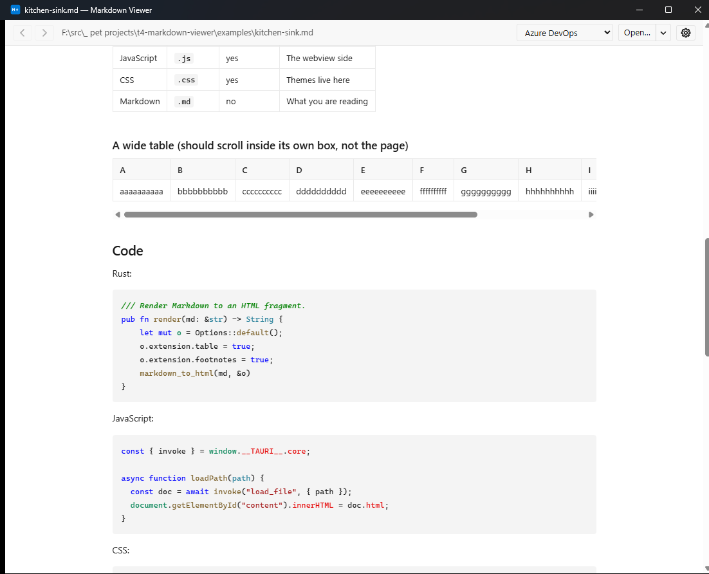
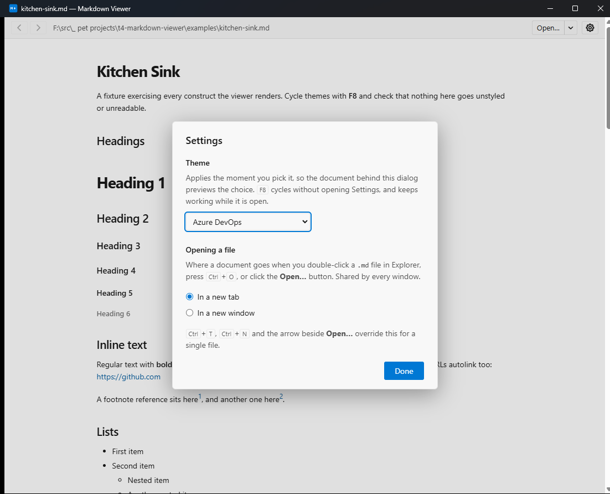
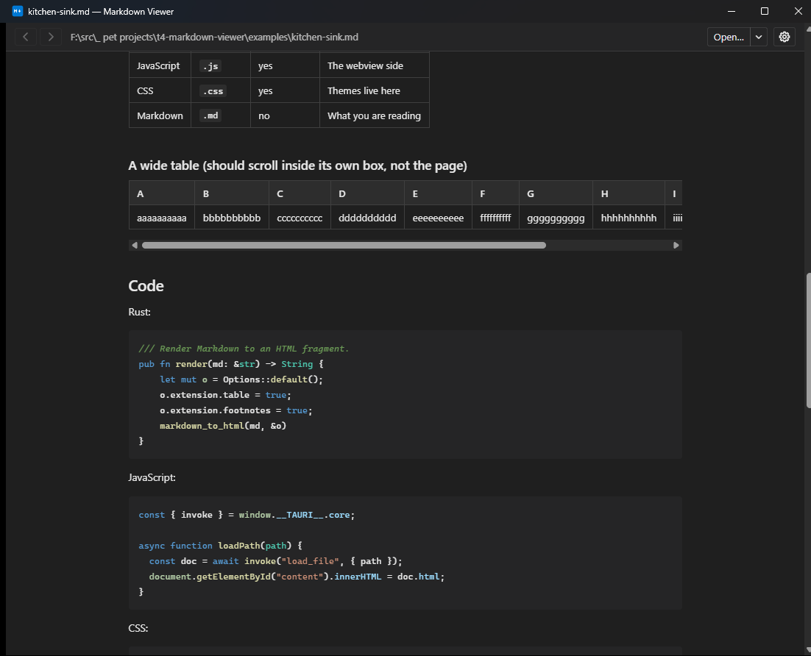
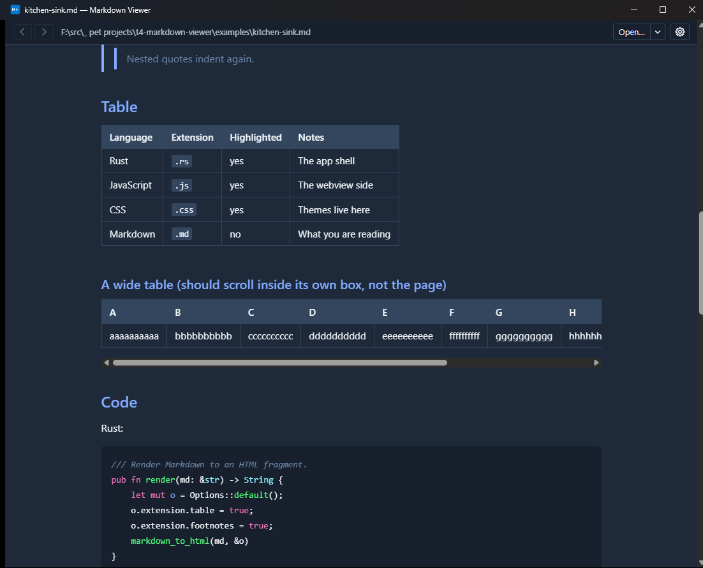
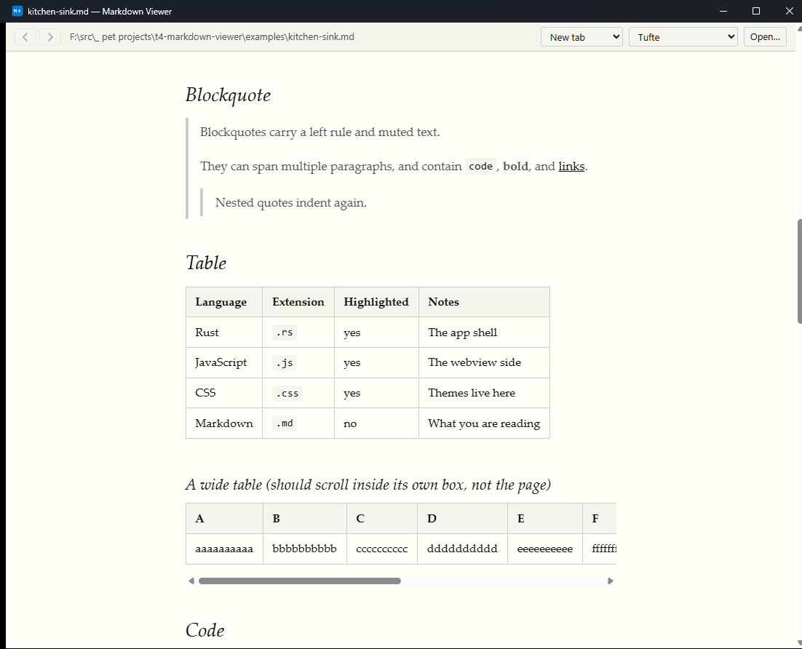

# T4 Markdown Viewer

A small, themeable Markdown viewer for Windows. Double-click a `.md` file and
read it. No editing, no bundled browser.

Built on [Tauri v2](https://v2.tauri.app) — a Rust shell around the WebView2
runtime that already ships with Windows 11. The whole app is a single ~6 MB
executable; a comparable Electron build starts around 150 MB.



## Features

- **Open by double-click.** `.md`, `.markdown`, `.mdown`, `.mkd`, `.mdtext`
  are registered by the installer.
- **Tabs or windows.** Read several documents at once, and choose per taste
  whether an opened file lands in a new tab or its own window. Tabs drag to
  reorder, into another window, or out onto the desktop to become one.
- **Themes are CSS files.** Eleven bundled, and you can drop your own into a
  folder. The default rebuilds the Azure DevOps wiki look.
- **Live reload.** Edit in another editor; the view updates on save and keeps
  your scroll position.
- **Syntax highlighting** for fenced code blocks.
- **GFM**: tables, task lists, footnotes, strikethrough, autolinks,
  definition lists.

## Installing

Download `T4 Markdown Viewer_0.1.0_x64-setup.exe` from the **Releases** page —
or build it yourself, in which case it lands in
`src-tauri/target/release/bundle/nsis/`.

It is a **per-user** install — no admin prompt — landing in
`%LOCALAPPDATA%\T4 Markdown Viewer`. Uninstall from Add/Remove Programs.

**The installer is not code-signed**, so Windows SmartScreen will show
"Windows protected your PC" the first few times anyone runs it: click **More
info** → **Run anyway**. A certificate is the only thing that removes that
prompt, and it is not worth several hundred dollars a year for this. Each
release lists the installer's SHA-256 so you can check you got what was built:

```powershell
Get-FileHash '.\T4 Markdown Viewer_0.1.0_x64-setup.exe' -Algorithm SHA256
```

### Making it the default for `.md`

**The installer cannot do this, and neither can any other installer.** Windows
10/11 protect the current default in

```
HKCU\Software\Microsoft\Windows\CurrentVersion\Explorer\FileExts\.md\UserChoice
```

with a per-user hash that Explorer validates. Anything that writes there without
the correct hash is ignored or reset. Setting a default is deliberately a
user gesture. Note this outranks `HKCU\Software\Classes\.md`, so if any app has
ever claimed `.md`, installing this one changes nothing on its own.

What the installer *does* do is make sure the app is actually offered:

- `Software\Classes\Applications\t4-markdown-viewer.exe` with `FriendlyAppName`,
  `DefaultIcon` and `SupportedTypes` — populates "Open with"
- `.<ext>\OpenWithProgids` → `T4MarkdownViewer.Document` for all five extensions
- `Software\T4MarkdownViewer\Capabilities` + a `RegisteredApplications` entry —
  makes it appear in Settings → Default apps

Then pick one:

**From Explorer** — right-click any `.md` → **Open with** → **Choose another
app** → **T4 Markdown Viewer** → tick **Always use this app to open .md files**.

**From Settings** — Settings → Apps → Default apps → search *T4 Markdown
Viewer* → click the `.md` tile → select it.

Repeat per extension if you want `.markdown`, `.mdown`, `.mkd`, `.mdtext` too;
Windows tracks each one separately.

## Keyboard

| Key | Action |
| --- | --- |
| `Alt+←` / `Alt+→` | Back / forward through visited documents |
| `Ctrl+O` | Open a file, wherever Settings says |
| `Ctrl+T` | Open a file in a new **tab** |
| `Ctrl+N` | Open a file in a new **window** |
| `Ctrl+W` | Close the current tab |
| `Ctrl+Shift+T` | Reopen the last closed tab |
| `Ctrl+Tab` / `Ctrl+Shift+Tab` | Next / previous tab |
| `Ctrl+R` | Re-render the current file |
| `F8` | Next theme (`Shift+F8` for previous) |

Mouse thumb buttons work for back/forward, and middle-click closes a tab.

Theme cycling used to be `Ctrl+T`; it moved to `F8` so the tab shortcuts could
follow the conventions every browser and editor already uses.

### History

Relative `.md` links load in place and build a back/forward stack, as in a
browser. **History is per tab**, so Back in one tab can never walk into a
document you opened in another. Each entry remembers its scroll position, so
going Back returns you to the spot you left rather than the top of the page.
Navigating after going back discards the forward branch.

In-page `#anchor` links jump without creating a history entry — Back skips
straight to the previous *document*.

## Tabs and windows



The **gear** opens Settings, where a pair of radio buttons decides where a file
opens: in a new tab, or in a new window. That covers every way a document
arrives without you saying otherwise — double-clicking it in Explorer, `Ctrl+O`,
or the **Open…** button. It is shared by every open window, because an Explorer
double-click has to land *somewhere* and per-window disagreement about that is
unguessable.

To go against the default just this once, use the **arrow beside Open…** — it
offers *Open in new tab* and *Open in new window* directly, and changes nothing
about the saved setting. `Ctrl+T` and `Ctrl+N` are the same two overrides from
the keyboard.

Everything runs in one process no matter how many windows are open, so a second
window costs a webview rather than a whole second copy of the app.

### Dragging tabs

The tab strip appears once a window holds two documents. From there a tab can be

- dragged left and right to reorder,
- dropped onto another viewer window to move it there — that window shows a
  caret where it would land, and takes focus once you let go,
- or dropped anywhere else, including this window's own text, to tear it out
  into a new window at the cursor.

Once a tab leaves the strip it vacates its slot and a chip follows the cursor in
its place. A tab carries its history and scroll positions with it.

**The drop target is whatever window you can see** under the cursor, decided by
real z-order rather than a guess. Releasing over your own window tears the tab
off even if another window happens to be buried underneath — you could not have
aimed at something invisible, so it does not count as a target.

With a single document the strip is hidden, so the **file path in the toolbar
becomes the drag handle**. Tearing off there would just recreate the window you
already have, but dropping it onto another window merges the two, leaving this
one empty.

Closing the last tab leaves the window empty rather than destroying it; a window
disappearing from under you is a worse surprise than an empty one.

## Themes

Bundled: `azure-devops` (default), `azure-devops-dark`, `github-light`,
`github-dark`, `solarized-light`, `solarized-dark`, `dracula`, `dracula-green`,
`dracula-blue`, `sakura`, `tufte`.

The same page in four of them — a theme owns every colour, the type scale and
the code chrome, so they are not recolourings of one look:

| | |
| --- | --- |
|  |  |
| `azure-devops-dark` | `dracula-blue` |
|  |  |
| `tufte` | `azure-devops` |

To write your own, copy `themes/_template.css` into

```
%APPDATA%\t4-markdown-viewer\themes\
```

It shows up in the Settings list immediately and re-applies every time you save
it. A file there shadows a bundled theme with the same name. Full contract in
[`src-tauri/themes/README.md`](src-tauri/themes/README.md).

Themes are picked from the dropdown in **Settings** (the gear), and applied the
moment you select one — the document behind the dialog is the preview, which is
why that dialog's backdrop is barely tinted. `F8` cycles without opening
Settings, and keeps working while it is open.

## Building

Requires only a Rust toolchain — there is no Node.js build step. The frontend
is plain HTML/CSS/JS served straight out of `src/`.

```sh
cargo install tauri-cli          # once
cd src-tauri
cargo test                       # renderer + path handling
cargo tauri dev                  # run
cargo tauri build                # NSIS installer in target/release/bundle
```

To open a file during development, pass it to the built binary directly:

```sh
./target/debug/t4-markdown-viewer.exe ../examples/kitchen-sink.md
```

`examples/kitchen-sink.md` exercises every construct the renderer supports —
use it when checking a theme.

## Design notes

**Raw HTML is stripped, not rendered.** The app opens arbitrary files off disk,
so `<script>`, `<iframe>`, inline event handlers and `style` attributes never
reach the webview. This also means benign inline HTML — `<kbd>`, `<sub>`,
`<br>` — does not render. That is a deliberate trade, not a bug.

**With one exception: explicit anchor targets.** `<a id="f12"></a>`,
`<a name="…">` and `<span id="…">` are extremely common in hand-written
Markdown — they are how you point a `[F12](#f12)` link at something that is not
a heading — and stripping them silently breaks every such link in a document.
So the renderer walks comrak's AST for those tags, and substitutes the
`<!-- raw HTML omitted -->` placeholders they leave behind with a generated
`<span id="…"></span>`. Nothing but the identifier survives: no other
attributes, no text, and ids outside `[A-Za-z0-9._:-]` are refused, so nothing
in the source can break out of the attribute. Enabling comrak's `unsafe` option
instead would have been one line, but it also switches raw URLs back on — the
`javascript:` hole this app most needs closed.

**Highlighting runs in the webview,** using a vendored highlight.js rather than
Rust's `syntect`. `syntect` bakes colors into inline `style` attributes, which
CSS themes cannot override — that would defeat the point of CSS theming. The
cost is that a very large, code-heavy document highlights on the UI thread.

Blocks with no declared language are *not* auto-detected. Detection is often
wrong and costs real time; they get the theme's plain code background instead.

**Windows never fires `RunEvent::Opened`.** A file-association open arrives as
a command-line argument in a brand-new process. `tauri-plugin-single-instance`
forwards that `argv` to the running instance, which routes it to a tab in the
most recently focused window or to a new window, per the setting; cold starts
read it in `setup()`.

**Dragging is pointer capture, not HTML5 drag-and-drop.** DnD cannot cross a
webview boundary and every window here is its own webview. Instead the bar
captures the pointer, and Rust answers "which of my windows is under this screen
point" with `WindowFromPoint` — the compositor's own answer, since Tauri exposes
no z-order and window rectangles alone cannot tell which one is on top. A tab is
plain JSON — path plus history — so moving one between windows is a hand-off
through Rust rather than any kind of webview state migration.

**Screen coordinates come from the window, not the pointer event.**
`screenX * devicePixelRatio` assumes a single scale factor for the whole
desktop and lands in the wrong place across monitors set to different scaling.
Rust reports the window's own physical origin and scale at drag start, and the
frontend maps `clientX/clientY` through those.

Three things about that were only discoverable by hitting them:

- **New windows need to be in a capability.** `capabilities/default.json` lists
  the windows its permissions apply to. With only `main` there, a runtime-created
  window is denied `event.listen` and `window.show` — so it boots half-way and
  then hangs, invisible, with no error anywhere. Hence the `w*` entry.
- **`listen()` defaults to the `Any` target,** which also receives events Rust
  addressed to a *different* window via `emit_to`. Left alone, one warm-opened
  file appears in every window and one dropped tab is adopted by all of them.
  Per-window events are listened for with an explicit `AnyLabel` target.
- **`WebviewWindowBuilder::build()` deadlocks on the event loop thread.** It
  waits for the loop to construct the webview, and both callers — a synchronous
  command and the single-instance hook — already run *on* that loop. Windows are
  therefore built on a worker thread.

## Layout

```
src/                  frontend — no bundler, no npm
  index.html
  app.js              tabs, per-tab history, dragging, settings dialog
  base.css            structure only; declares no document colors
  vendor/             highlight.js
src-tauri/
  src/
    main.rs           windows, argv routing, drag hit-testing, commands
    render.rs         comrak: Markdown -> HTML
    themes.rs         theme discovery
    watch.rs          debounced per-window file + theme watching
    config.rs         persisted settings
  capabilities/       permission scope — must cover runtime windows
  themes/             bundled theme catalog
examples/             kitchen-sink fixture
```

## License

MIT — see [`LICENSE`](LICENSE).

Every dependency is permissively licensed and compatible with that; nothing in
the tree is GPL, LGPL, AGPL or SSPL. Five transitive crates are MPL-2.0, whose
file-level copyleft expressly allows combining them into an MIT-licensed larger
work. Per-license breakdown and attribution in
[`src-tauri/THIRD-PARTY-LICENSES.md`](src-tauri/THIRD-PARTY-LICENSES.md).
