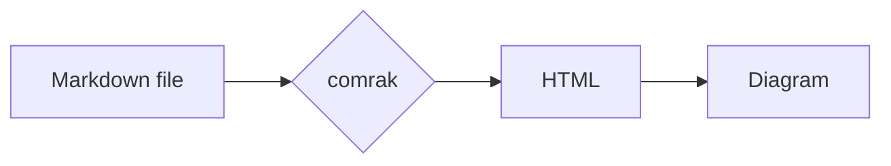
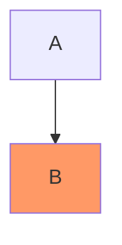
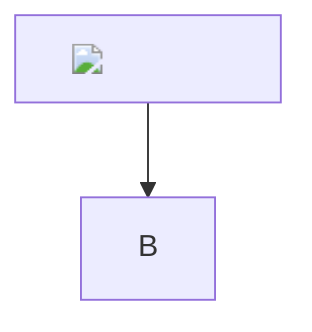
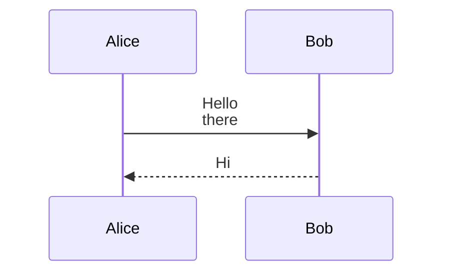
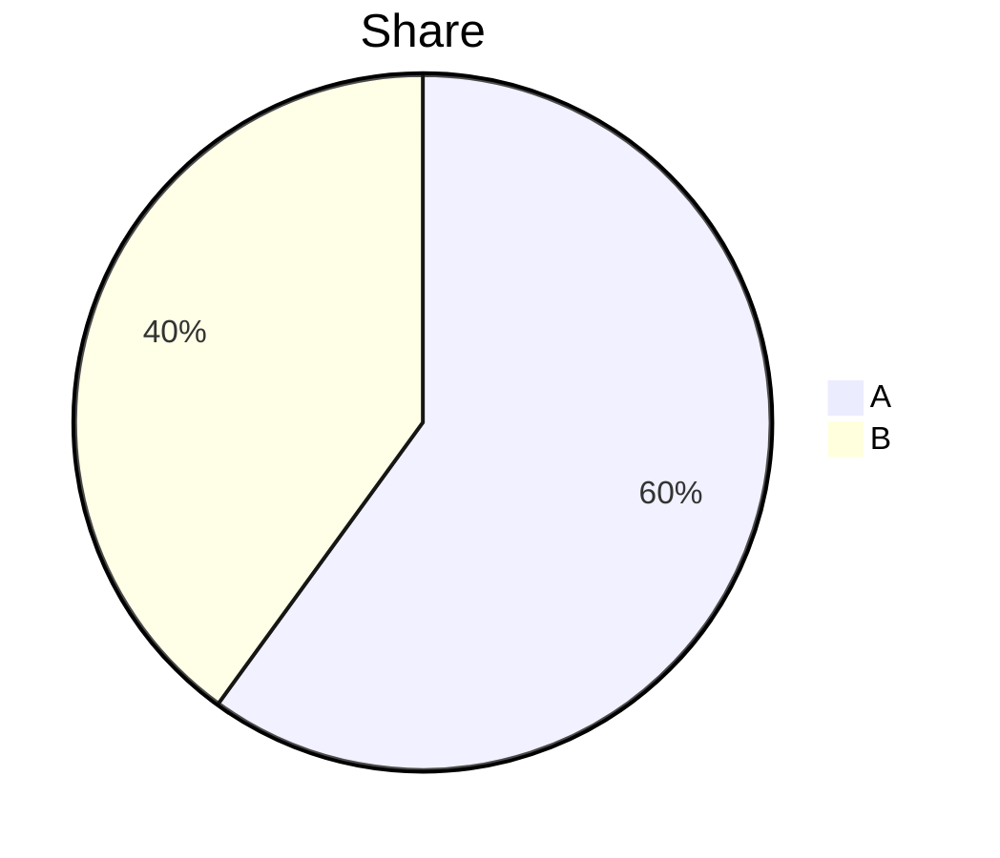

# Mermaid Diagrams Implementation Plan

> **For agentic workers:** REQUIRED SUB-SKILL: Use superpowers:subagent-driven-development (recommended) or superpowers:executing-plans to implement this plan task-by-task. Steps use checkbox (`- [ ]`) syntax for tracking.

**Goal:** A fenced ` ```mermaid ` block in a Markdown document renders as a diagram instead of as code.

**Architecture:** Frontend only; Rust is unchanged. comrak already emits `<pre><code class="language-mermaid">`. A vendored mermaid build, loaded the first time a document contains a diagram, renders every diagram to an SVG string **before** the page is painted. Results go in a cache keyed by theme and source. `renderDocument` then swaps them in synchronously, so the existing scroll restore lands on a page that already has its full height. A theme change re-renders the page through `refresh()`. Clicking a diagram opens a copy of its SVG in a full-window `<dialog>` with zoom and pan. The overlay is used because a diagram has no file for the image viewer's tab to open. mermaid's SVG is also not valid standalone XML (`&nbsp;`, HTML `<br>`), so an ``/blob route would break.

**Tech Stack:** mermaid 11.17.2 IIFE build (`dist/mermaid.min.js`, 3,572,661 bytes, sha256 `581ed7d74bd9048d0e3a91363927d72ef22942d7722546b27f7cc29e35390eb8`), plain JS in `src/app.js`, no bundler.

**Spec:** none. This plan is the spec, from chat on 2026-09-26.

## Outcome (2026-09-26)

Done: bf0a58b, which squashes Tasks 1–3 and every follow-up below. Found while running it:

- **Tauri nonces `style-src`**, which switched off the CSP's own `'unsafe-inline'`, so mermaid's `<style>` and `style` attributes were ignored and diagrams painted as black boxes. The owner chose to stop the style-src nonce (`dangerousDisableAssetCspModification: ["style-src"]`) over re-applying styles through the CSSOM. `base.css` had already noted the nonce; the plan missed it.
- **mermaid renders without yielding,** so `stale()` never turned true mid-batch. A `setTimeout` yield before each render fixed check J (a newer switch now paints in 28 ms, not 245 ms).
- **The plan's thumb-Back handler lacked `preventDefault`,** so the webview walked its `#id` history under the overlay. Fixed in Task 3. Task 3 also dropped the focus ring round the whole view.
- **The plan's `npm init --prefix`** ignores the prefix and wrote a `package.json` into the repo root. The script above is corrected.
- **A pre-existing bug surfaced:** heading ids collide with the app's element ids (`## Image` renders a screen tall). Fixed cfd1e00 (`heading-id-collision.md`), and closed in `closed-items.md` under Deferred.
- **A review loop after the plan ran nine rounds,** until one found no bugs. It:
  - put scroll bookkeeping on one record of the page on screen, `shownEntry`;
  - closed the overlay over a diagram that had changed or gone;
  - redrew diagrams in place on a look change instead of refreshing;
  - closed two HTML-label routes: a directive turning them back on, and `$$…$$` math. Math is now refused, and a foreignObject backstop exempts journey and venn, which are text-only, and event modeling, which is accepted.
- **Triage of the loop's skips, 2026-09-27:**
  - Fixed in b55b9a4: a stale scroll-restore frame, a picture's wheel/scrollbar pan, and redundant scroll banking. Fixed in bf0a58b: a diagram node classed `mermaid-error` being removed on a redraw.
  - Tracked in `open-items.md` → Deferred: five items, with a sixth folded into the keyboard item.
  - Kept in `closed-items.md` → Accepted limits: seven items.
- **A second review loop on those fixes** ran three rounds, until one found no bugs; its fixes are in b55b9a4 and bf0a58b. It kept one more accepted limit: input within a frame of a render can bank the page before its restore.

## Global Constraints

- mermaid **11.17.2**, not 12.x. 12.0.0 (2026-09-10) targets ES2024 / Safari 17.4+, which is riskier on the `minimumSystemVersion: 13.0` macOS WebView. Its single-file build is also 5.5 MB. Re-evaluate at a later release.
- Vendored verbatim at `src/vendor/mermaid.min.js`, the way `highlight.min.js` is. No npm, no bundler (README: "frontend — no bundler, no npm").
- The CSP text is unchanged: `script-src 'self'`. The 11.17.2 build was checked: 0 × `eval(`, 0 × `new Function`, 0 × `import(`. It defines `globalThis.mermaid`.
- Tauri must stop adding its nonce to `style-src`: `app.security.dangerousDisableAssetCspModification: ["style-src"]`. The nonce switches off the `'unsafe-inline'` the CSP already declares (see `base.css`'s `#icons` note). mermaid's embedded `<style>` and its `style` attributes were then ignored, and diagrams painted as black boxes at full column size. This was measured in the first run and decided with the owner on 2026-09-26. Script nonces stay. The only HTML that reaches the page is comrak's (raw HTML stripped, so no style attributes), `json.rs`'s, and mermaid's (sanitized, SVG-text labels, CSS nested under the diagram's own id).
- `securityLevel: "strict"` always. Files come off disk untrusted (README "Raw HTML is stripped"). Diagram directives cannot lower it, because mermaid treats `securityLevel` as a secure key.
- `htmlLabels: false`, and `flowchart.htmlLabels: false`, which flowcharts still read. Strict mode alone still lets a DOMPurify-filtered subset of HTML into labels, `style` attributes included. SVG-text labels keep the README's promise that no HTML from the file reaches the page. `<br>` and markdown strings still work.
- `suppressErrorRendering: true`. A bad diagram must not leave mermaid's "syntax error" bomb SVG in `<body>`.
- `base.css` declares no document colours. The new rules are layout only.
- Commits go straight to `main` and are never pushed. Feature subjects take no prefix; doc-only commits take `docs:`.

## Review Focus

1. **Live-editing a diagram into a syntax error.** The source block stays visible, an error line appears under it, nothing is left behind in `<body>`, and the scroll position holds. (Task 1, Step 6 checks C and D.)
2. **A hostile diagram** (`` in a label, `click A "javascript:…"`). Nothing executes, no `javascript:` link appears, and no label HTML reaches the page. (Task 1, Step 6 checks E and H.)
3. **Scroll position with diagrams above the viewport:** a save to the file, a tab switch and back, and Back/Forward. Each must return to the same spot. This is why diagrams render before paint. (Task 1, Step 6 checks F, G and I.)
4. **A theme switch while diagrams are on screen.** They redraw in the new palette at the same scroll spot. A theme change racing a render must not cache an SVG under the wrong theme. (Task 2, Step 2.)
5. **A document with no diagrams.** mermaid is never loaded, so startup and plain documents cost nothing extra. (Task 1, Step 6 check A.)

---

### Task 1: Render mermaid blocks as diagrams

**Files:**
- Create: `src/vendor/mermaid.min.js` (downloaded, verbatim)
- Modify: `src-tauri/tauri.conf.json` (`app.security`), and `src/base.css`'s `#icons` comment (~line 144), which the nonce change makes stale
- Modify: `src/app.js`: new diagrams section after `highlight()` (~line 381), `renderDocument` (~line 469), `showActive` (~line 705)
- Modify: `src/base.css`: after the `.markdown-body pre` rule (~line 1340)
- Modify: `examples/kitchen-sink.md`: new `## Diagram` section after `## Code` (~line 121)
- Modify: `src-tauri/THIRD-PARTY-LICENSES.md`, `README.md` (design note ~line 474, layout ~line 547), `.claude/skills/release/SKILL.md` (~line 35)

**Interfaces:**
- Produces: `warmDiagrams(html: string, stale: () => boolean): Promise<void>` (never rejects; stops early once `stale()` is true), `renderDiagrams(root: Element): void`, and `diagramKey(theme, source)`. The container class `.mermaid-diagram` holds exactly one `<svg>` with a mermaid `id`. Tasks 2 and 3 look for it.

No Rust test is added. The existing `gfm_constructs_render` assertion on `class="language-rust"` already pins the `language-*` contract this relies on. The frontend has no test harness, so Step 6 verifies in the running app.

- [x] **Step 1: Vendor mermaid**

```bash
curl -sL https://cdn.jsdelivr.net/npm/mermaid@11.17.2/dist/mermaid.min.js -o "F:/src/_ pet projects/t4-markdown-viewer/src/vendor/mermaid.min.js"
sha256sum "F:/src/_ pet projects/t4-markdown-viewer/src/vendor/mermaid.min.js"
```
Expected: `581ed7d74bd9048d0e3a91363927d72ef22942d7722546b27f7cc29e35390eb8`. Stop if it differs.

Do **not** add a `<script>` tag to `index.html`. It is loaded on demand in Step 2.

- [x] **Step 2: Add the diagrams section to `src/app.js`, right after `highlight()`**

```js
/* ---------------- diagrams ---------------- */

/**
 * Mermaid is 3.5 MB of script, so it loads the first time a document has a
 * diagram rather than with the page: a window that never shows one never pays
 * for it.
 */
let mermaidLoad = null;
function loadMermaid() {
  mermaidLoad ??= new Promise((resolve, reject) => {
    const s = document.createElement("script");
    s.src = "vendor/mermaid.min.js";
    s.onload = () => resolve(window.mermaid);
    s.onerror = () => {
      mermaidLoad = null; // the next document tries again
      reject(new Error("The diagram renderer did not load."));
    };
    document.head.append(s);
  });
  return mermaidLoad;
}

const MERMAID_BLOCK = "pre > code.language-mermaid";

/**
 * Finished diagrams, `{ svg }` or `{ error }`, by theme and source. Filled
 * before a document is painted, so `renderDiagrams` swaps them in without
 * waiting — which is what lets the scroll restore land on a page that already
 * has its full height. A save that leaves a diagram alone redraws it for free.
 */
const diagrams = new Map();
// ponytail: dropped wholesale past this; an LRU if live editing ever makes it churn
const DIAGRAMS_KEPT = 200;
let diagramId = 0;
/** One warm at a time: `initialize` is global, so two interleaved would draw in each other's theme. */
let diagramQueue = Promise.resolve();

function diagramKey(theme, source) {
  return `${theme}\0${source}`;
}

/**
 * Draw every diagram in `html` not already in `diagrams`. Resolves once each
 * has drawn or failed, or as soon as `stale()` says a newer switch has won —
 * the queue is one at a time, and a document left behind must not hold up the
 * one that replaced it. Never rejects: a renderer that will not load leaves
 * the blocks as code.
 */
function warmDiagrams(html, stale) {
  // Both renderers escape `"` in text, so only a real code block matches.
  if (!html.includes('class="language-mermaid"')) return Promise.resolve();
  const t = document.createElement("template");
  t.innerHTML = html;
  const sources = new Set([...t.content.querySelectorAll(MERMAID_BLOCK)].map((c) => c.textContent));
  const run = async () => {
    if (stale()) return;
    // Read together, before any wait: the theme can change while this is out,
    // and a diagram drawn in one theme must not be filed under the next.
    const theme = state.theme;
    const dark = currentTheme()?.mode === "dark";
    const fontFamily = getComputedStyle(els.content).fontFamily;
    let todo = [...sources].filter((s) => !diagrams.has(diagramKey(theme, s)));
    if (!todo.length) return;
    const mermaid = await loadMermaid();
    // Past the limit, start over — this document included, or the diagrams it
    // already had would be dropped and shown as code.
    if (diagrams.size + todo.length > DIAGRAMS_KEPT) {
      diagrams.clear();
      todo = [...sources];
    }
    mermaid.initialize({
      startOnLoad: false,
      securityLevel: "strict",
      suppressErrorRendering: true,
      // Labels as SVG text, not HTML: strict mode still lets a filtered subset
      // of markup through, and nothing from the file reaches the page as HTML.
      // Flowcharts read their own, deprecated, copy of the switch.
      htmlLabels: false,
      flowchart: { htmlLabels: false },
      theme: dark ? "dark" : "default",
      fontFamily,
    });
    for (const source of todo) {
      if (stale()) return; // the rest wait for this document to come back
      let done;
      try {
        // Capitalised: comrak's heading slugs are lower case, so this id can
        // never collide with a `#section` link target.
        done = { svg: (await mermaid.render(`Mermaid-${++diagramId}`, source)).svg };
      } catch (err) {
        done = { error: String(err?.message ?? err) };
      }
      diagrams.set(diagramKey(theme, source), done);
    }
  };
  diagramQueue = diagramQueue.then(run).catch(console.error);
  return diagramQueue;
}

/** Swap each Mermaid block for its warmed diagram. One that failed keeps its source and says why. */
function renderDiagrams(root) {
  root.querySelectorAll(MERMAID_BLOCK).forEach((code) => {
    const done = diagrams.get(diagramKey(state.theme, code.textContent));
    const pre = code.parentElement;
    if (done?.svg) {
      const fig = document.createElement("div");
      fig.className = "mermaid-diagram";
      fig.innerHTML = done.svg;
      pre.replaceWith(fig);
    } else if (done?.error) {
      const p = document.createElement("p");
      p.className = "mermaid-error";
      p.textContent = done.error;
      pre.after(p);
    }
  });
}
```

- [x] **Step 3: Call it from `renderDocument`, before `highlight`**

Before `highlight`, so a drawn diagram's `<pre>` is gone by the time highlight.js looks. A failed one stays and gets `highlight()`'s existing unknown-language fallback.

```js
  resolveMedia(els.content, doc.dir, doc.repo);
  wrapTables(els.content);
  renderDiagrams(els.content);
  highlight(els.content);
```

- [x] **Step 4: Warm before painting, in `showActive`'s document branch**

```js
      const doc = await invoke("load_file", { path: entry.path, extent: entry.extent });
      if (token !== renderToken) return; // a newer switch already won
      // Drawn before the page is swapped, so it lands at its full height and
      // the scroll restore below it is exact.
      await warmDiagrams(doc.html, () => token !== renderToken);
      if (token !== renderToken) return;
      entry.path = doc.path;
```

- [x] **Step 5: CSS, example and docs**

`src-tauri/tauri.conf.json`, in `app.security`, after `"csp"`:

```json
      "dangerousDisableAssetCspModification": ["style-src"],
```

`src/base.css`, the `#icons` comment (~line 144) becomes:

```css
/* The shared icon sprite in index.html. Hidden here rather than with a style
   attribute, to keep presentation in CSS. (Inline styles do apply: Tauri is
   told not to nonce style-src, which would switch 'unsafe-inline' off and
   leave Mermaid's diagrams unstyled.) */
```

`src/base.css`, after the `.markdown-body pre` rule:

```css
/* A diagram is held to the column by mermaid's own max-width; one wider still scrolls in its own box. */
.markdown-body .mermaid-diagram {
  overflow-x: auto;
  margin: 0 0 1em;
  text-align: center;
}

/*
 * Why a diagram did not draw, under the source that is shown in its place.
 * mermaid's parse errors are several lines with a `^` under the fault, so the
 * lines are kept and the font is the code font the caret was aligned in.
 */
.markdown-body .mermaid-error {
  margin: -0.5em 0 1em;
  font-family: "Cascadia Mono", Menlo, Consolas, "Courier New", monospace;
  font-size: 0.8125em;
  white-space: pre-wrap;
}
```

`examples/kitchen-sink.md`, a new section before `## Image`:

````markdown
## Diagram

A fenced `mermaid` block draws as a diagram:


````

`src-tauri/THIRD-PARTY-LICENSES.md`: the bundle keeps notices only for lodash, DOMPurify and cytoscape. esbuild drops every other package's licence text. So the packages inside it are listed here, generated from a scratch install. `S` is the scratchpad path. Use `--prefix` rather than `cd`, per the bash-on-Windows rule.

```bash
S="<your session's scratchpad directory, absolute, forward slashes>/mermaid-licenses"
# Not `npm init --prefix`: it ignores the prefix and writes into the cwd. Create
# "$S/package.json" containing {"private": true} with the Write tool instead.
npm install --prefix "$S" --omit=dev --no-audit --no-fund mermaid@11.17.2
npm ls --prefix "$S" --all --omit=dev --parseable > "$S/dirs.txt"
node -e '
const fs = require("fs"), path = require("path");
const dirs = fs.readFileSync(process.argv[1], "utf8").trim().split(/\r?\n/).slice(1);
const by = {};
for (const d of dirs) {
  // `npm ls` may redact part of a temp path as `***`; rebuild it from $S.
  const dir = d.replace(/^.*?mermaid-licenses/, process.argv[2]);
  const p = JSON.parse(fs.readFileSync(path.join(dir, "package.json"), "utf8"));
  if (p.name === "mermaid") continue;
  const l = typeof p.license === "string" ? p.license : (p.license?.type ?? "UNKNOWN");
  (by[l] ??= new Set()).add(p.name);
}
for (const l of Object.keys(by).sort())
  console.log(`| \`${l}\` | ${by[l].size} | ${[...by[l]].sort().join(", ")} |`);
' "$S/dirs.txt" "$S"
find "$S/node_modules" -maxdepth 3 -iname "NOTICE*"
```

Stop and report if any licence is `UNKNOWN` or copyleft other than DOMPurify's `(MPL-2.0 OR Apache-2.0)`. Then add, after the highlight.js section:

```markdown
### Mermaid

`src/vendor/mermaid.min.js` — v11.17.2, redistributed verbatim. MIT.
Copyright (c) 2014 - 2022 Knut Sveidqvist. <https://mermaid.js.org>

It is a single-file build with its dependencies inside it. Only lodash,
DOMPurify and cytoscape keep their notices in the file, so every package the
build draws on is listed here, from `npm ls --all --omit=dev` on
`mermaid@11.17.2` — a superset, since the bundler drops what goes unused.

| License | Packages | Names |
| --- | --- | --- |
<the rows the script printed>

DOMPurify is used under Apache-2.0. The Apache-2.0 packages ship no `NOTICE`
file to preserve. <Or, if `find` printed any: paste each NOTICE's text here
under the package's name.>

Regenerate with `npm install mermaid@<version> --omit=dev` in an empty folder,
then group `npm ls --all --omit=dev --parseable` by each `package.json`'s
`license`.
```

`README.md`, feature list: add after the `**Syntax highlighting**` bullet (~line 52):

```markdown
- **Mermaid diagrams.** A ` ```mermaid ` block draws as a diagram, in the
  theme's light or dark palette; one that will not parse shows its source and why.
```

`README.md`, design notes: add after the "Blocks with no declared language…" paragraph:

```markdown
**Mermaid diagrams draw in the webview too,** from a vendored mermaid build
loaded the first time a document has a ` ```mermaid ` block. They are drawn
before the page is swapped in, so a refresh or a tab switch returns to the same
spot, and in `strict` security mode with labels drawn as SVG text rather than
HTML, so a diagram's labels and `click` lines cannot run script or put markup
on the page. They take mermaid's `default` or `dark` palette from the
theme's side, not the theme's CSS. One that will not parse stays as code with
the reason under it.

mermaid styles each diagram with a `<style>` element and `style` attributes of
its own, so Tauri is told not to add its nonce to `style-src`
(`dangerousDisableAssetCspModification`). A nonce switches off the
`'unsafe-inline'` the CSP declares, which silently dropped both. Script nonces
are untouched, and nothing from a file reaches the page with a style attribute:
comrak strips raw HTML, and mermaid's labels are SVG text.
```

Also change the layout line `vendor/             highlight.js` to `vendor/             highlight.js, mermaid`.

`.claude/skills/release/SKILL.md`: rename the bullet `**highlight.js.**` to `**highlight.js and mermaid.**`. Replace its text with: `src/vendor/highlight.min.js` and `src/vendor/mermaid.min.js` are vendored, so Dependabot never offers a new release. Check for one; a bump swaps the file and its version line in `src-tauri/THIRD-PARTY-LICENSES.md`. mermaid stays on 11.x until 12.x is checked against the macOS 13 WebView.

- [x] **Step 6: Verify in the running app (use the `drive-app` skill)**

Run `cargo test --manifest-path src-tauri/Cargo.toml` first; `kitchen-sink.md` is `include_str!`'d by a render test. Expected: all pass.

Write this fixture to the scratchpad as `mermaid-check.md`. It needs 60 filler paragraphs where marked, so the page scrolls well past the diagrams.

````markdown
# Diagram check



```mermaid
flowchart TD
  A -->
```







<!-- 60 paragraphs of filler here -->

[Kitchen sink](<absolute path to examples/kitchen-sink.md>)

End.
````

Checks, each as JS evaluated in the page, with the expected result:

- **A. Lazy load.** Launch with no session to restore (Settings → Reopening → Start fresh, or an empty session file per the drive-app skill), then open `README.md`: `typeof window.mermaid` → `"undefined"`. Record `document.body.childElementCount` as `N`.
- **B. Draws.** Open `mermaid-check.md`: `document.querySelectorAll("#content .mermaid-diagram svg").length` → `4` (flowchart, hostile, sequence, pie; the broken one fails). Each SVG's `getBoundingClientRect()` is non-zero in both dimensions. The first flowchart's rendered width is its own `max-width` (well under 300 px), not the column width. Its embedded `<style>` has a non-null `.sheet`. Node `A`'s rect fill is the palette's (not black). Node `B`'s is `rgb(255, 153, 102)`. Report how long the open took to paint.
- **B2. The rest of the UI is unchanged by the nonce change.** `getComputedStyle(document.getElementById("icons")).display` → `"none"`. Screenshot the empty screen, a document with the sidebar open, and the Settings dialog, and compare by eye with the same screens on the parent commit's build. Themes still switch (F8).
- **C. Error.** `document.querySelectorAll("#content pre > code.language-mermaid").length` → `1`. `document.querySelector("#content .mermaid-error").textContent` is non-empty.
- **D. No leftovers.** `document.body.childElementCount` → `N`.
- **E. Hostile.** `window.__pwned` → `undefined`. `document.querySelectorAll('#content [onerror], #content a[href^="javascript"]').length` → `0`. DOMPurify may keep the `` itself; the handler is what must go.
- **F. Refresh keeps the spot.** Scroll to the bottom and record `scrollY`. Append a line to the end of the file on disk and wait for the watcher refresh. `scrollY` is within 1px of the recorded value.
- **G. Tab switch keeps the spot.** Open `kitchen-sink.md` in a new tab, switch back: `scrollY` within 1px again. The kitchen-sink diagram draws.
- **H. No label HTML.** `document.querySelectorAll("#content .mermaid-diagram foreignObject").length` → `0`. The hostile label shows `` breaks the line.
- **I. Back keeps the spot.** Scroll to the bottom and record `scrollY`. Click the kitchen-sink link, then press `Alt+Left`: `scrollY` is within 1px of the recorded value.
- **J. A newer switch wins.** Temporarily write 40 *distinct* flowcharts (`A0-->B0` … `A39-->B39`; identical copies collapse into one render) into a second file, and clear the cache first (reload the app). Open that file, and immediately (under 100 ms) open `README.md`. `README.md` paints within its usual time, not after 40 renders.
- Screenshot both files in one light theme and one dark theme for the report.

- [x] **Step 7: Commit**

```bash
git -C "F:/src/_ pet projects/t4-markdown-viewer" add src/vendor/mermaid.min.js src/app.js src/base.css src-tauri/tauri.conf.json examples/kitchen-sink.md src-tauri/THIRD-PARTY-LICENSES.md README.md .claude/skills/release/SKILL.md
git -C "F:/src/_ pet projects/t4-markdown-viewer" commit -m "Draw Mermaid diagrams from mermaid code blocks"
```
The commit ends with the `Co-Authored-By` trailer. Do not push.

---

### Task 2: Redraw diagrams when the theme changes

**Files:**
- Modify: `src/app.js`, `applyTheme` (~line 2400)
- Modify: `docs/open-items.md`: a new `## Deferred` section

**Interfaces:**
- Consumes: `.mermaid-diagram` (Task 1) and the existing `refresh()` (~line 1846), which re-renders in place and keeps the scroll spot.

Without this, a diagram keeps the old palette until the next reload. The cache key already includes the theme, so a refresh after the theme change finds no cached SVG and warms fresh ones before painting.

- [x] **Step 1: In `applyTheme`, after `updateThemeToggle();` in the `try` block**

```js
    // Diagrams are drawn in the theme's palette rather than styled by its CSS,
    // so the ones on screen have to be drawn again.
    if (!els.content.hidden && els.content.querySelector(".mermaid-diagram"))
      refresh().catch(console.error);
```

Not awaited: `selectTheme` saves the choice after `applyTheme` returns, and should not wait on a redraw.

- [x] **Step 2: Verify (drive-app)**

With `mermaid-check.md` open and scrolled so that a diagram is in view:
- Record `scrollY` and `getComputedStyle(document.querySelector("#content .mermaid-diagram .node rect, #content .mermaid-diagram .node polygon")).fill` as `F1`.
- Click the light/dark toggle. `fill` is not `F1` and `scrollY` is within a few px. The palette's fonts can shift the height slightly, so report the delta.
- Press F8 twice quickly. When it settles, the diagram's palette matches the final theme's side (`dark` vs `default`), not an intermediate one.

- [x] **Step 3: Track the colour deferral in `docs/open-items.md`**

Add a new section before `## Accepted limits`:

```markdown
## Deferred

- [ ] **Diagrams in the theme's own colours** (added 2026-09-26, `archive/plans/mermaid-diagrams.md`).
  Diagrams take mermaid's `default` or `dark` palette by the theme's side, and the theme's body
  font; a Dracula or Solarized document gets the same diagram colours as any other dark or light
  one. Fix: mermaid's `base` theme, with `themeVariables` read from the theme's computed styles
  (page background, text, code background, link colour), then a contrast check by eye across
  all bundled themes. Reopen when a bundled theme's diagrams clash visibly, or someone asks.
```

- [x] **Step 4: Commit**

```bash
git -C "F:/src/_ pet projects/t4-markdown-viewer" add src/app.js docs/open-items.md
git -C "F:/src/_ pet projects/t4-markdown-viewer" commit -m "Redraw Mermaid diagrams when the theme changes"
```

---

### Task 3: Click a diagram to zoom it

**Files:**
- Modify: `src/index.html`: a new `<dialog>` after `#update-dialog` (~line 241)
- Modify: `src/app.js`: `els` (~line 66); a diagram-overlay section after the Task 1 diagrams section; `onLinkClick` (~line 2589); the modal guard in `onKeydown` (~line 2920); `onMouseUp` (~line 3024); listeners in boot (~line 3210)
- Modify: `src/base.css`: the `#image-tools` / `#zoom-level` rules (~lines 1115–1160); new overlay rules after them; the `.mermaid-diagram` rule from Task 1
- Modify: `README.md` (feature list ~line 49, keyboard table ~line 235), `docs/open-items.md`

**Interfaces:**
- Consumes: `.mermaid-diagram` containing one mermaid `<svg>` with an `id` (Task 1), plus the existing `ZOOM_STEP`, `ZOOM_MIN`, `ZOOM_MAX` and `PAN_THRESHOLD` (~lines 512–515).
- Produces: `openDiagram(fig: Element): void`.

The overlay is a copy of the SVG in a full-window modal `<dialog>`. It is not a tab: there is no history, session entry or drag. 100% means "fits the window", as for an SVG in the image viewer. The viewer's zoom code is hard-wired to `els.imageEl`/`picture`/the tab entry, so the overlay gets its own small copy rather than refactoring shipped code.

- [x] **Step 1: Markup, in `src/index.html` after `#update-dialog`**

```html
    <!-- A diagram from the document, full window. Mermaid draws no file, so
         the image viewer's tab has nothing to open; this borrows its look. -->
    <dialog id="diagram-dialog" aria-label="Diagram">
      <div id="diagram-view" tabindex="0"></div>
      <div id="diagram-tools">
        <button type="button" data-zoom="out" title="Zoom out (Ctrl+-)" aria-label="Zoom out">−</button>
        <span id="diagram-level" role="status"></span>
        <button type="button" data-zoom="in" title="Zoom in (Ctrl++)" aria-label="Zoom in">+</button>
        <button type="button" data-zoom="fit" title="Fit to window (Ctrl+0)">Fit</button>
        <button type="button" data-zoom="close" title="Close (Esc)" aria-label="Close">×</button>
      </div>
    </dialog>
```

In `els`, after `copyIcon`:

```js
  diagramDialog: document.getElementById("diagram-dialog"),
  diagramView: document.getElementById("diagram-view"),
  diagramTools: document.getElementById("diagram-tools"),
  diagramLevel: document.getElementById("diagram-level"),
```

- [x] **Step 2: CSS**

Add `#diagram-tools` / `#diagram-level` as a second selector on each existing toolbar rule, so the overlay's toolbar is the image viewer's:

```css
#image-tools,
#diagram-tools {
```
Do the same for `#image-tools:hover`, `#image-tools button`, `#image-tools button:hover`, `#image-tools button:focus-visible` and `#zoom-level` (→ `#zoom-level, #diagram-level`). `position: absolute` needs a positioned ancestor. A modal dialog is one: the browser's own `dialog:modal` rule makes it `position: fixed`.

Then, after `#zoom-level`:

```css
/*
 * A diagram at full window, over the document. It wears the page's own
 * background, which is what the diagram was drawn against.
 */
#diagram-dialog {
  /* Percentages, not 100vw/100dvh: a modal dialog's box is the viewport less
     its scrollbars, and vw counts the document's scrollbar in. */
  width: 100%;
  height: 100%;
  max-width: none;
  max-height: none;
  margin: 0;
  padding: 0;
  border: 0;
  background: var(--page-bg);
}

#diagram-view {
  height: 100%;
  overflow: auto;
  /* A diagram that fits has nothing to scroll, and the wheel would otherwise
     go on to the document underneath and cost it its place. */
  overscroll-behavior: contain;
  display: flex;
  cursor: grab;
}

#diagram-view.panning {
  cursor: grabbing;
}

/* Sized in px by the zoom; the rest is `#image-el`'s reasoning. */
#diagram-view svg {
  display: block;
  margin: auto;
  flex: none;
  max-width: none;
  -webkit-user-select: none;
  user-select: none;
}
```

And on Task 1's rule, add `cursor: zoom-in;` to `.markdown-body .mermaid-diagram`, matching `img[data-file]`.

- [x] **Step 3: The overlay, in `src/app.js` after the diagrams section**

```js
/* ---------------- diagram overlay ---------------- */

/*
 * A diagram at column width can be too small to read, and unlike a picture it
 * has no file for the image viewer to open in a tab. A click opens a copy of it
 * full window instead, with the viewer's zoom and pan; Escape comes back to the
 * same spot. 100% is what fits, as for an SVG in the viewer.
 */
let zoomed = null; // { svg, ratio, scale } while the overlay is open
let diagramPan = null;

function diagramFit() {
  const box = els.diagramView;
  return Math.max(1, Math.min(box.clientWidth, box.clientHeight * zoomed.ratio));
}

/** Resize about a point, measured before and after for the reason `zoomTo` gives. */
function zoomDiagram(scale, clientX, clientY) {
  if (!zoomed) return;
  const box = els.diagramView.getBoundingClientRect();
  const before = zoomed.svg.getBoundingClientRect();
  const ax = clientX ?? box.left + box.width / 2;
  const ay = clientY ?? box.top + box.height / 2;
  const fx = before.width ? (ax - before.left) / before.width : 0.5;
  const fy = before.height ? (ay - before.top) / before.height : 0.5;

  zoomed.scale = Math.min(ZOOM_MAX, Math.max(ZOOM_MIN, scale));
  const width = diagramFit() * zoomed.scale;
  zoomed.svg.style.width = `${width}px`;
  zoomed.svg.style.height = `${width / zoomed.ratio}px`;
  els.diagramLevel.textContent = `${Math.round(zoomed.scale * 100)}%`;

  const after = zoomed.svg.getBoundingClientRect();
  els.diagramView.scrollLeft += after.left + fx * after.width - ax;
  els.diagramView.scrollTop += after.top + fy * after.height - ay;
}

function openDiagram(fig) {
  const original = fig.querySelector("svg");
  // Its shape as drawn on the page. Not off the viewBox, which WebKit hands
  // back as null when a diagram has none.
  const { width, height } = original.getBoundingClientRect();
  // Its own ids: the copy's styles and arrowheads then point at itself rather
  // than at the original, which a re-render can take away while this is open.
  els.diagramView.innerHTML = fig.innerHTML.replaceAll(original.id, `${original.id}-zoom`);
  const svg = els.diagramView.querySelector("svg");
  // mermaid's `max-width` and `width="100%"` would hold it to the window. The
  // rest of its inline style — a background, on some diagrams — stays.
  svg.style.maxWidth = "none";
  svg.removeAttribute("width");
  svg.removeAttribute("height");
  zoomed = { svg, ratio: width && height ? width / height : 1, scale: 1 };
  els.diagramDialog.showModal();
  zoomDiagram(1);
  els.diagramView.scrollTo(0, 0);
  els.diagramView.focus();
}

function onDiagramClose() {
  zoomed = null;
  diagramPan = null;
  els.diagramView.replaceChildren();
}

function onDiagramPointerDown(event) {
  if (!zoomed || event.button !== 0) return;
  event.preventDefault();
  diagramPan = { pointerId: event.pointerId, x: event.clientX, y: event.clientY, moved: false };
  els.diagramView.setPointerCapture(event.pointerId);
}

function onDiagramPointerMove(event) {
  if (!diagramPan || event.pointerId !== diagramPan.pointerId) return;
  if (event.buttons === 0) return onDiagramPointerUp(event);
  const dx = event.clientX - diagramPan.x;
  const dy = event.clientY - diagramPan.y;
  if (!diagramPan.moved && Math.hypot(dx, dy) < PAN_THRESHOLD) return;
  diagramPan.moved = true;
  diagramPan.x = event.clientX;
  diagramPan.y = event.clientY;
  els.diagramView.classList.add("panning");
  els.diagramView.scrollLeft -= dx;
  els.diagramView.scrollTop -= dy;
}

function onDiagramPointerUp(event) {
  if (!diagramPan || event.pointerId !== diagramPan.pointerId) return;
  diagramPan = null;
  try {
    els.diagramView.releasePointerCapture(event.pointerId);
  } catch {
    /* capture already gone */
  }
  els.diagramView.classList.remove("panning");
}

function onDiagramWheel(event) {
  if (!zoomed || !event.ctrlKey) return;
  event.preventDefault();
  const dy = event.deltaMode === 1 ? event.deltaY * 16 : event.deltaY;
  zoomDiagram(zoomed.scale * Math.exp(-dy * 0.002), event.clientX, event.clientY);
}

function onDiagramDblClick(event) {
  if (!zoomed) return;
  zoomDiagram(zoomed.scale === 1 ? 2.5 : 1, event.clientX, event.clientY);
}

function onDiagramToolsClick(event) {
  const what = event.target.closest("button[data-zoom]")?.dataset.zoom;
  if (!zoomed || !what) return;
  if (what === "in") zoomDiagram(zoomed.scale * ZOOM_STEP);
  else if (what === "out") zoomDiagram(zoomed.scale / ZOOM_STEP);
  else if (what === "fit") zoomDiagram(1);
  else if (what === "close") els.diagramDialog.close();
}

/** The same Ctrl spellings the picture tab takes. Escape is the dialog's own. */
function onDiagramKeydown(event) {
  if (!zoomed || !(event.ctrlKey || event.metaKey) || event.altKey) return;
  if (event.key === "+" || event.key === "=") zoomDiagram(zoomed.scale * ZOOM_STEP);
  else if (event.key === "-") zoomDiagram(zoomed.scale / ZOOM_STEP);
  else if (event.key === "0") zoomDiagram(1);
  else return;
  event.preventDefault();
}
```

- [x] **Step 4: Wire it up**

In `onLinkClick`, in the `if (!a)` branch after the `img[data-file]` block and before `return;`:

```js
    const fig = event.target.closest(".mermaid-diagram");
    if (fig) openDiagram(fig);
```

In `onKeydown`, extend the modal guard so the document's shortcuts (Back included) stay off while the overlay is up:

```js
  if (els.settings.open || els.updateDialog.open || els.diagramDialog.open) {
```

In `onMouseUp` (~line 3024), first thing in the function. The thumb buttons are the one navigation the modal guard in `onKeydown` never sees:

```js
  // Over a zoomed diagram, the thumb's Back closes it rather than paging the
  // document behind; Forward has nowhere to go.
  if (els.diagramDialog.open) {
    if (event.button === 3) els.diagramDialog.close();
    return;
  }
```

In boot, after `els.imageTools.addEventListener("click", onZoomClick);`:

```js
  els.diagramView.addEventListener("wheel", onDiagramWheel, { passive: false });
  els.diagramView.addEventListener("pointerdown", onDiagramPointerDown);
  els.diagramView.addEventListener("pointermove", onDiagramPointerMove);
  els.diagramView.addEventListener("pointerup", onDiagramPointerUp);
  els.diagramView.addEventListener("pointercancel", onDiagramPointerUp);
  els.diagramView.addEventListener("dblclick", onDiagramDblClick);
  els.diagramTools.addEventListener("click", onDiagramToolsClick);
  els.diagramDialog.addEventListener("keydown", onDiagramKeydown);
  els.diagramDialog.addEventListener("close", onDiagramClose);
```

- [x] **Step 5: Docs**

`README.md`, feature list: in the `**Diagrams you can actually read.**` bullet, after "Clicking a picture embedded in a document opens the same view.", add: `A Mermaid diagram opens full window over the document, with the same zoom and pan; Escape comes back.`

`README.md`, keyboard table: change `— while a picture is open` to `— while a picture or a diagram is open`.

`docs/open-items.md`, under `## Needs a Mac or a Linux install`:

```markdown
- [ ] **Mermaid diagrams on macOS and Linux** (added 2026-09-26, `archive/plans/mermaid-diagrams.md`).
  `drive-app` proves them on Windows (WebView2) only. On a Mac (WKWebView, macOS 13 floor)
  and a deb/rpm install (WebKitGTK), open `examples/kitchen-sink.md`: the diagram draws,
  clicking it opens the overlay, `Cmd`/`Ctrl`+wheel zooms about the cursor, dragging pans,
  Escape comes back at the same scroll, and the light/dark toggle redraws it.
```

- [x] **Step 6: Verify (drive-app)**

With `kitchen-sink.md` open and scrolled so that the diagram is in view, record `scrollY`, then click the diagram:
- `els.diagramDialog.open` → `true`. `#diagram-level` reads `100%`. The SVG's width is within 1px of `min(view width, view height × ratio)`.
- `document.querySelectorAll('#diagram-view [id$="-zoom"]').length` > 0, and the view's `marker` elements are present, so arrowheads draw. Take a screenshot.
- Press `Ctrl+=`: level `125%`. `Ctrl+0`: `100%`. Ctrl+wheel over a node: the node stays under the cursor within a few px.
- At 250%, drag 100px left: `#diagram-view` `scrollLeft` grows by about 100.
- `Alt+Left`: the document behind does not navigate (the tab's `index` is unchanged).
- A mouse thumb-Back (dispatch `new MouseEvent("mouseup", { button: 3, bubbles: true })` on the view): the overlay closes and the tab's `index` is unchanged.
- At 100% (nothing to scroll), a plain wheel over the view (`scrollBy` is not enough; use a real wheel through CDP `Input.dispatchMouseEvent` type `mouseWheel`): the page's `scrollY` behind is unchanged.
- The toolbar sits fully inside the window: `#diagram-tools`'s `getBoundingClientRect().right` is at most `document.documentElement.clientWidth`.
- `Escape`: the dialog closes, `#diagram-view` is empty, and `scrollY` equals the recorded value.
- A plain click on a failed diagram's source block does nothing.

- [x] **Step 7: Commit**

```bash
git -C "F:/src/_ pet projects/t4-markdown-viewer" add src/index.html src/app.js src/base.css README.md docs/open-items.md
git -C "F:/src/_ pet projects/t4-markdown-viewer" commit -m "Open a Mermaid diagram full window to zoom and pan it"
```

---

### Finish: file the plan

The plan lives in `docs/plans/` (untracked) while it runs. Once Task 3 is committed, tick its boxes, move it where finished plans go, and commit:

```bash
mv "F:/src/_ pet projects/t4-markdown-viewer/docs/plans/mermaid-diagrams.md" "F:/src/_ pet projects/t4-markdown-viewer/docs/archive/plans/mermaid-diagrams.md"
git -C "F:/src/_ pet projects/t4-markdown-viewer" add docs/archive/plans/mermaid-diagrams.md
git -C "F:/src/_ pet projects/t4-markdown-viewer" commit -m "docs: Mermaid diagrams plan record"
```

## Deferred (tracked)

- **Theme-coloured diagrams:** open-items, `## Deferred` (Task 2, Step 3).
- **macOS and Linux runs:** open-items, `## Needs a Mac or a Linux install` (Task 3, Step 5).
- **mermaid 12:** the release skill's vendored-files check (Task 1, Step 5).
- **The reviews' items:** open-items, `## Deferred`. From the earlier reviews:
  - keyboard access, which now also covers focus lost on a redraw;
  - unnamespaced ids;
  - a render that never settles;
  - the double parse;
  - the 200-diagram cache;
  - the duplicated pan and zoom;
  - `docTarget` order.

  From the review loop:
  - Settings' Done button;
  - link clicks dropped mid-refresh;
  - the OS light/dark flip;
  - the overlay id rewrite;
  - the backstop's temporary render.
