# All Mermaid types

## flowchart

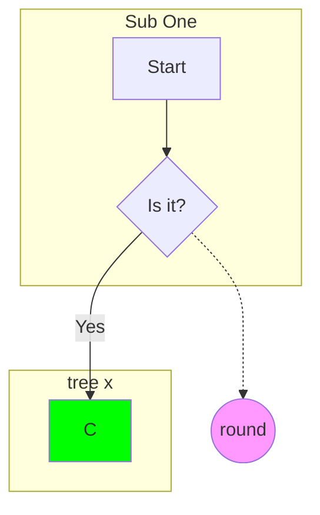

## sequence

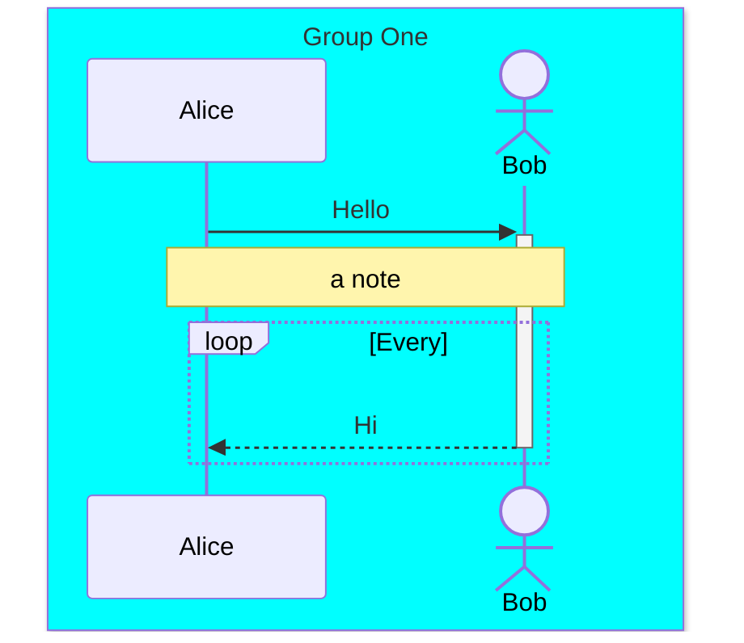

## class

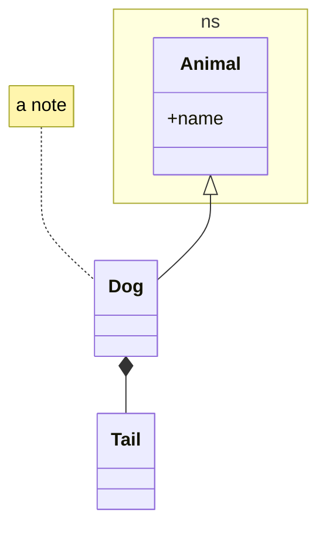

## state

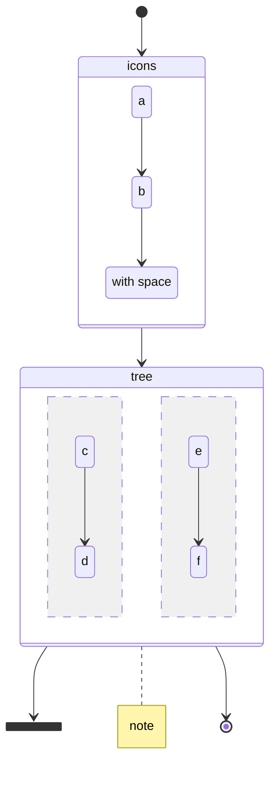

## er

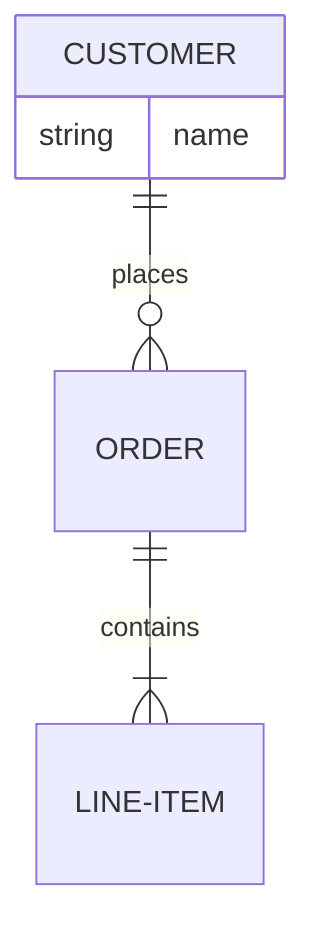

## gantt

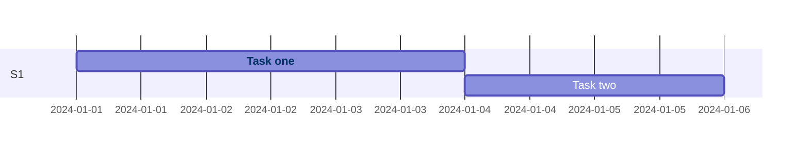

## pie

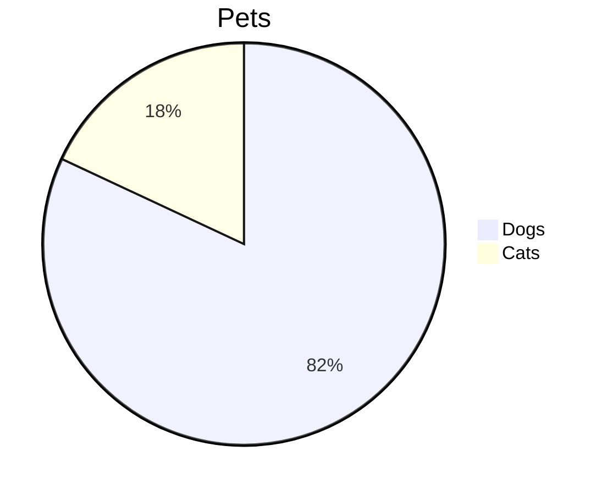

## journey

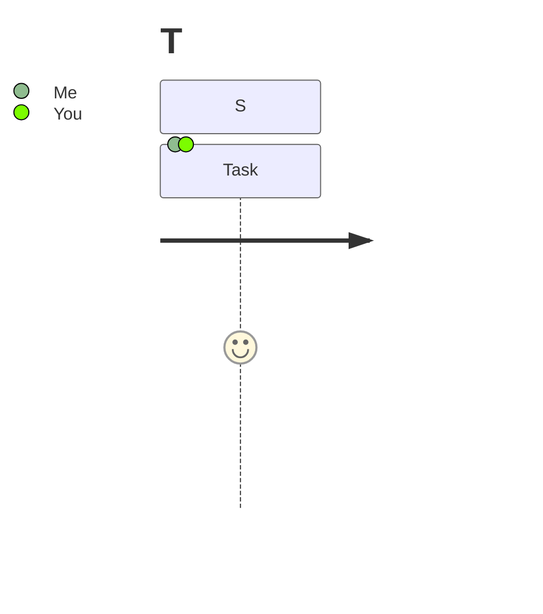

## gitGraph

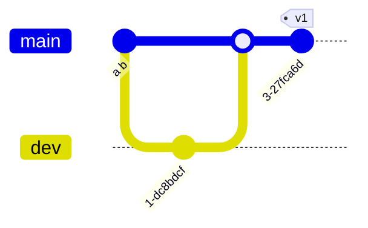

## mindmap

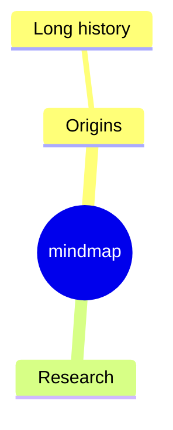

## timeline

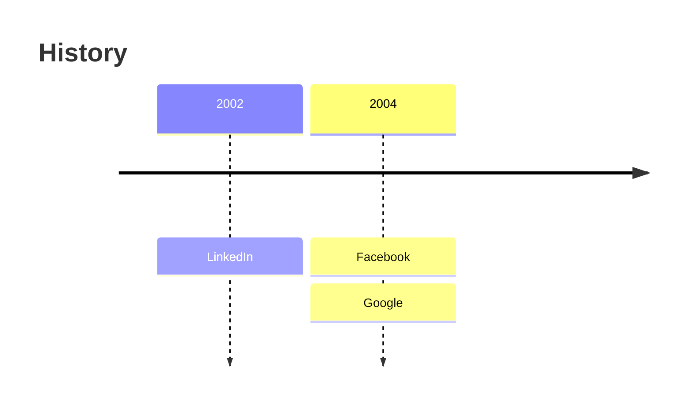

## quadrant

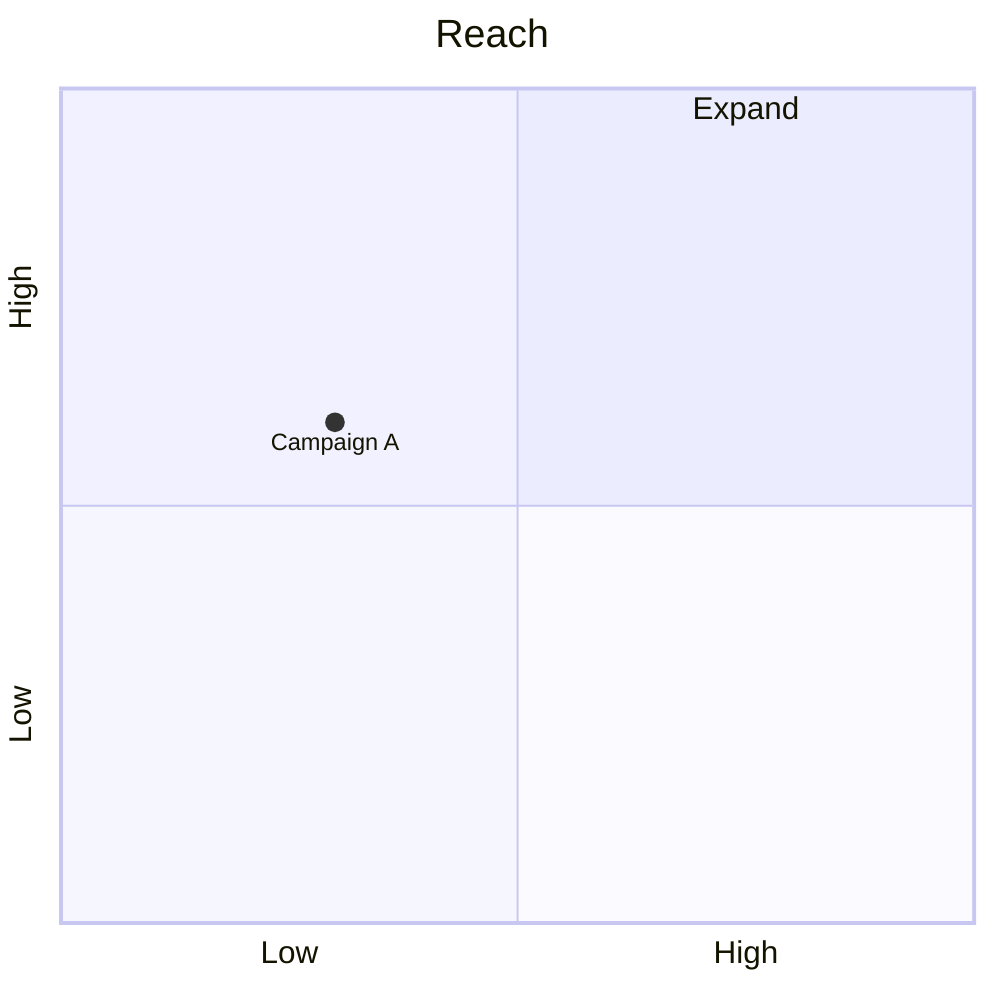

## requirement

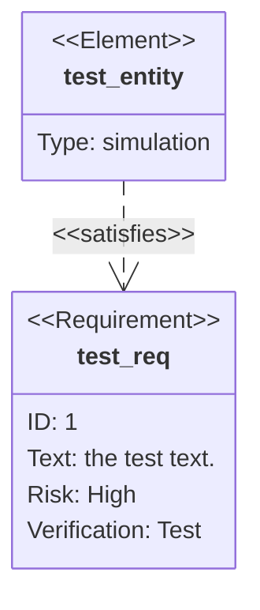

## sankey

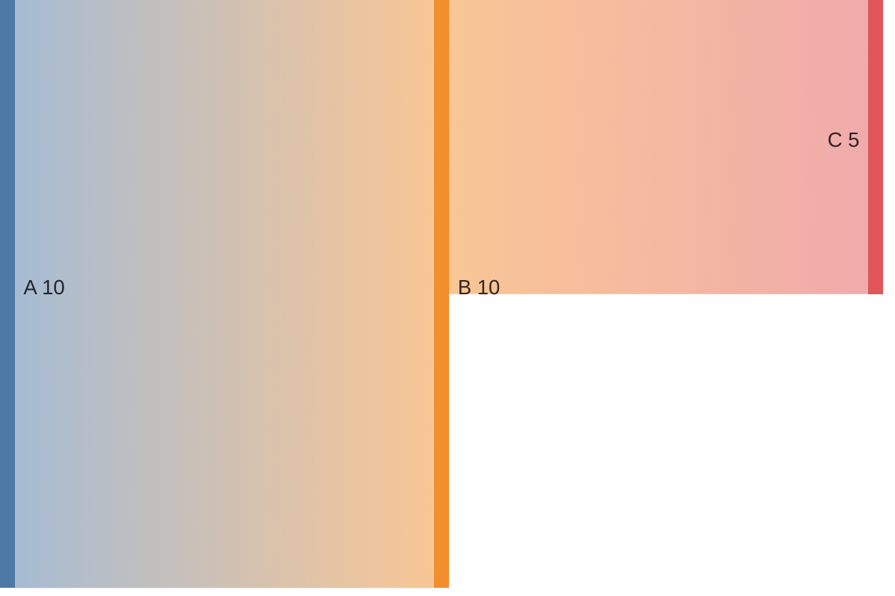

## xychart

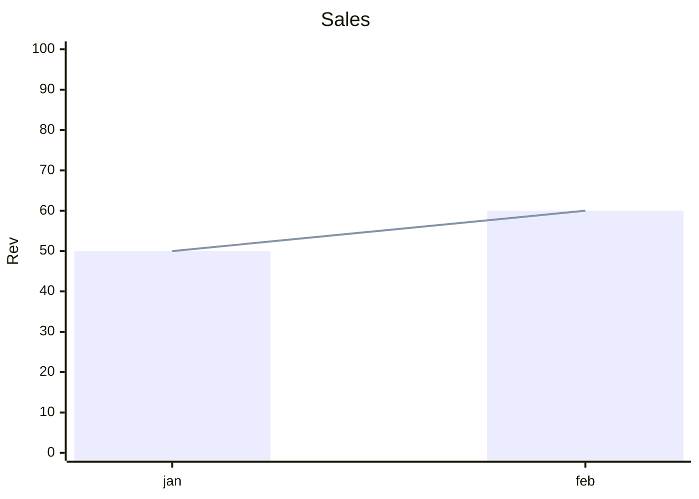

## block

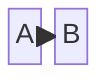

## packet

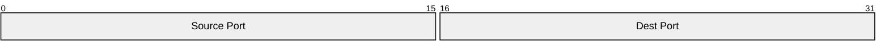

## kanban

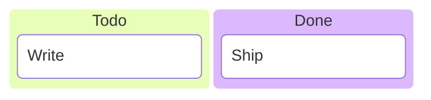

## architecture

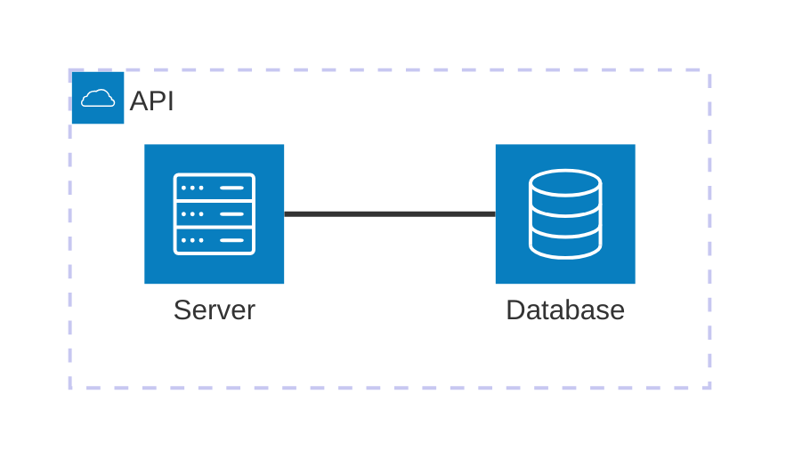

## c4

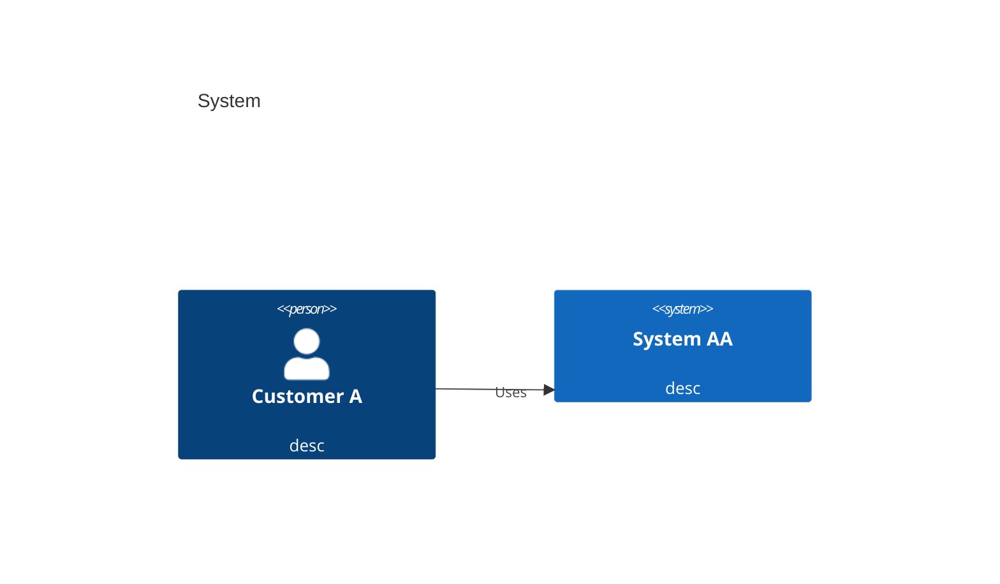

## radar

```mermaid
radar-beta
axis A, B, C
curve c1{1,2,3}
```

## treemap

```mermaid
treemap-beta
"Section 1"
  "Leaf 1.1": 12
"Section 2"
  "Leaf 2.1": 4
```

## venn

```mermaid
venn-beta
set A
set B
union A,B
```

## eventmodeling

```mermaid
eventmodeling
tf 01 ui ExampleScreen
tf 02 cmd DoThing
tf 03 evt ThingDone
```

## accessible

```mermaid
graph TD
accTitle: The title
accDescr: The description
A-->B
```

## ishikawa

```mermaid
ishikawa
Problem
  Cause A
    Sub
```

## oddFlow

```mermaid
graph LR
a.b --> c:d
subgraph s.1 [x]
  e_f
end
click a.b href "#x"
```

## oddState

```mermaid
stateDiagram-v2
state "Hello World" as h.w
[*] --> h.w
state co.mp {
  p.q --> r
}
h.w --> co.mp
```

## oddClass

```mermaid
classDiagram
class List~T~
class `Weird Name.x`
List~T~ <|-- `Weird Name.x`
```

## oddEr

```mermaid
erDiagram
"CUSTOMER X" ||--o{ ORDER.Y : places
```

## handDrawn

```mermaid
---
config:
  look: handDrawn
---
graph TD
A-->B
```

## neo

```mermaid
---
config:
  look: neo
---
graph TD
A-->B
```

## swimlaneBeta

```mermaid
swimlane-beta
subgraph icons [Lane A]
  a --> b
end
subgraph tree
  c
end
subgraph "x y"
  d
end
b --> c
```

## stateSwimlaneLayout

```mermaid
---
config:
  layout: swimlane
---
stateDiagram-v2
  state icons {
    a --> b
  }
  state tree {
    c --> d
  }
  icons --> tree
```

## flowSwimlaneLayout

```mermaid
---
config:
  layout: swimlane
---
flowchart LR
  subgraph icons
    a --> b
  end
  subgraph tree
    c
  end
  b --> c
```

## Heading B

This is heading B, the target of the click links above.

<!-- skipped: plan-themeCSS, balanced-themeCSS, quote-fontSize+themeCSS, quote-lineColor, quote-errorTextColor, frontmatter-quote, LOCKED quote-fontSize+themeCSS, LOCKED nested flowchart themeVariables -->
