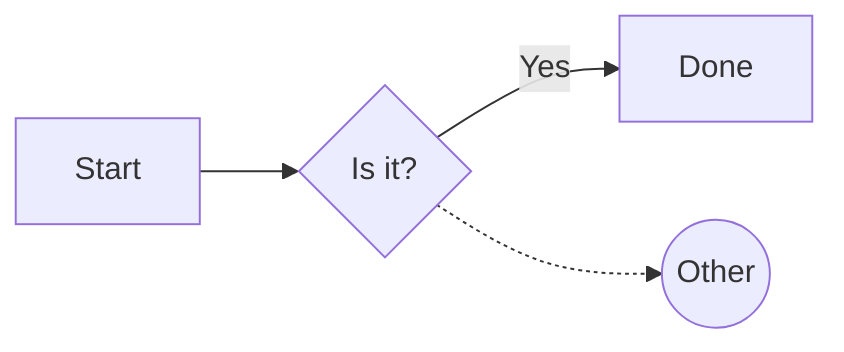

# Dup

```mermaid
flowchart LR
  A[Start] --> B{Is it?}
  B -->|Yes| C[Done]
  B -.-> D((Other))
```

Second copy

```mermaid
flowchart LR
  A[Start] --> B{Is it?}
  B -->|Yes| C[Done]
  B -.-> D((Other))
```

```mermaid
flowchart LR
  A[Start] --> B{Is it?}
  B -->|Yes| C[Done]
  B -.-> D((Other))
```
