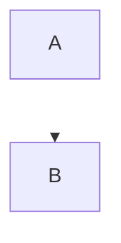

# Escape

A paragraph before the diagrams.

## lineColor

```mermaid
%%{init: {"themeVariables": {"lineColor": "red\""}, "themeCSS": "body { background: red } #content { display: none }"}}%%
graph TD; A-->B
```

## fontSize

```mermaid
%%{init: {"themeVariables": {"fontSize": "16px\""}, "themeCSS": "body { background: red } #content { display: none }"}}%%
graph TD; A-->B
```

## frontMatter

```mermaid
---
config:
  themeVariables:
    fontSize: '16px"'
---
graph TD; A-->B
```
