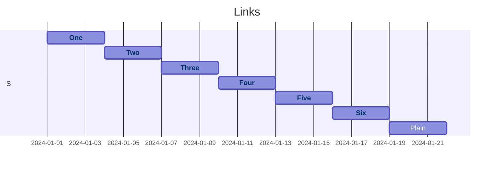

# Gantt links

Filler paragraph so the heading is below the fold.

Filler 1.

Filler 2.

Filler 3.

Filler 4.

Filler 5.

Filler 6.

Filler 7.

Filler 8.

Filler 9.

Filler 10.

Filler 11.

Filler 12.

Filler 13.

Filler 14.

Filler 15.

Filler 16.

Filler 17.

Filler 18.

Filler 19.

Filler 20.

Filler 21.

Filler 22.

Filler 23.

Filler 24.

Filler 25.

Filler 26.

Filler 27.

Filler 28.

Filler 29.

Filler 30.

Filler 31.

Filler 32.

Filler 33.

Filler 34.

Filler 35.

Filler 36.

Filler 37.

Filler 38.

Filler 39.

Filler 40.

Filler 41.

Filler 42.

Filler 43.

Filler 44.

Filler 45.

Filler 46.

Filler 47.

Filler 48.

Filler 49.

Filler 50.

Filler 51.

Filler 52.

Filler 53.

Filler 54.

Filler 55.

Filler 56.

Filler 57.

Filler 58.

Filler 59.

Filler 60.

## Heading B

The target.
