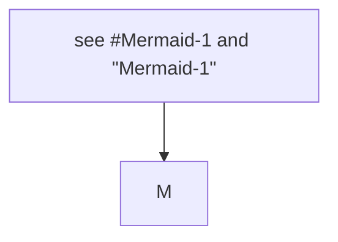
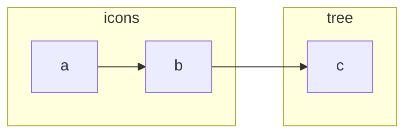
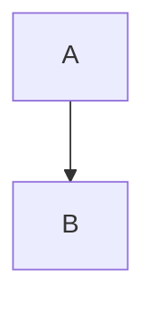

# Ids

## flowSwimlaneLayout

## Click

Filler one.

Filler two.

Filler three.

Filler four.

Filler five.

Filler six.

Filler seven.

Filler eight.

[to tree](#tree)

Filler nine.

Filler ten.

Filler eleven.

Filler twelve.

Filler thirteen.

Filler fourteen.

Filler fifteen.

Filler sixteen.

Filler seventeen.

Filler eighteen.

Filler nineteen.

Filler twenty.

## Heading B

Filler after.

Filler after two.

Filler after three.

Filler after four.

Filler after five.

Filler after six.

Filler after seven.

Filler after eight.

Filler after nine.

Filler after ten.
