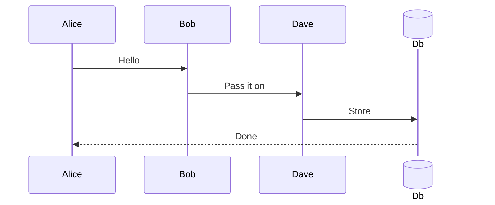

# Sequence links

Some document text to click.



Text between the copies.


## Stick figure

```mermaid
sequenceDiagram
  actor Carol
  participant Eve
  link Carol: Home @ https://example.com
  Carol->>Eve: Hi
```
